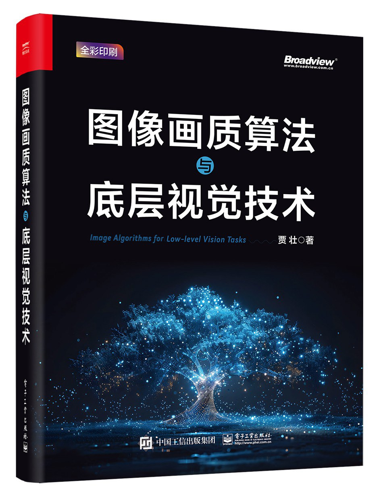
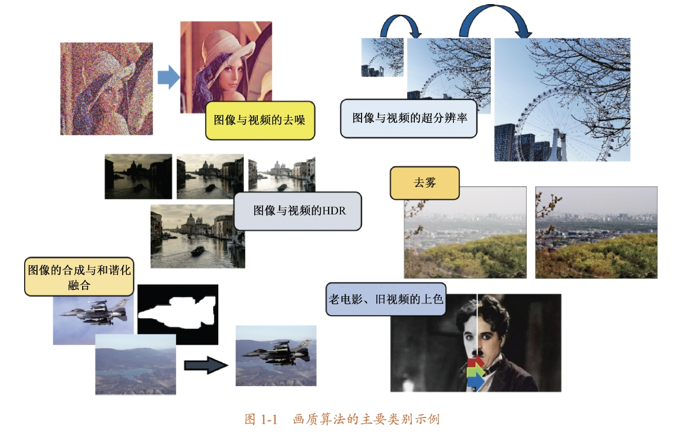
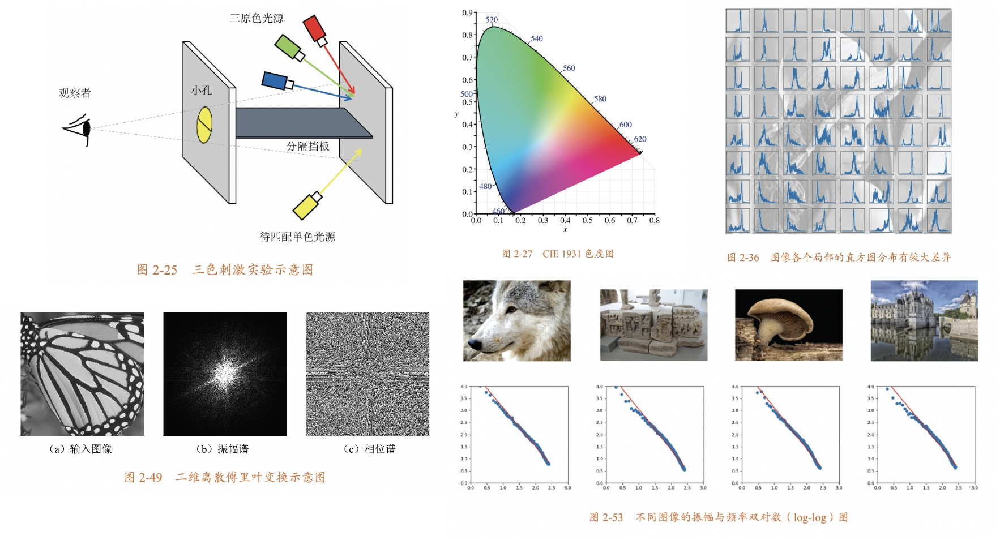
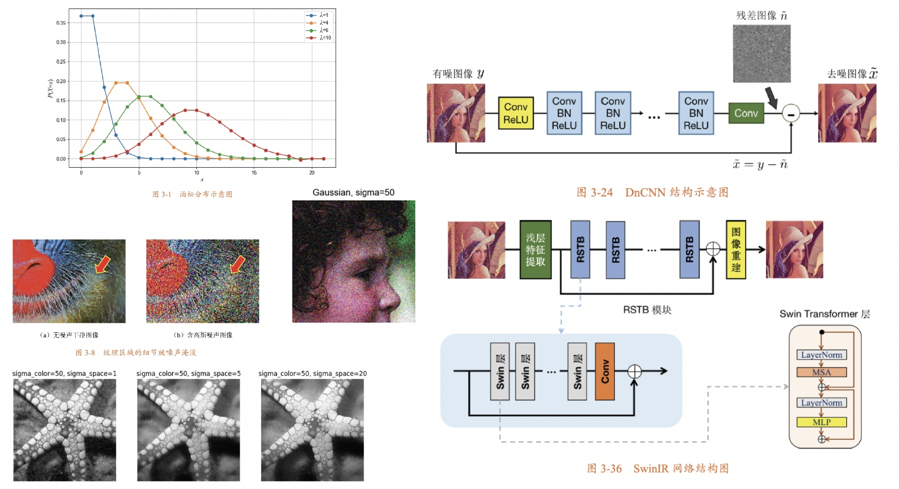
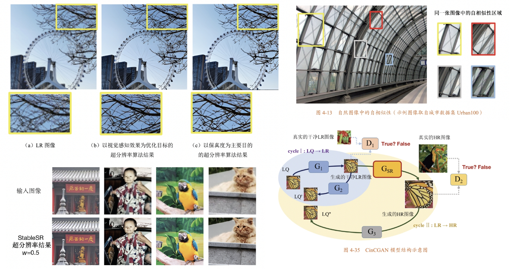
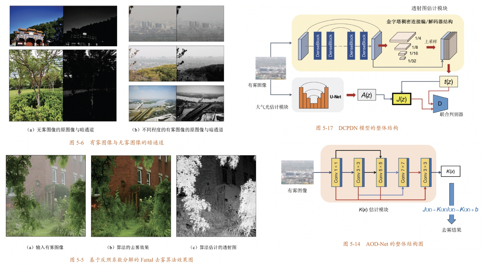
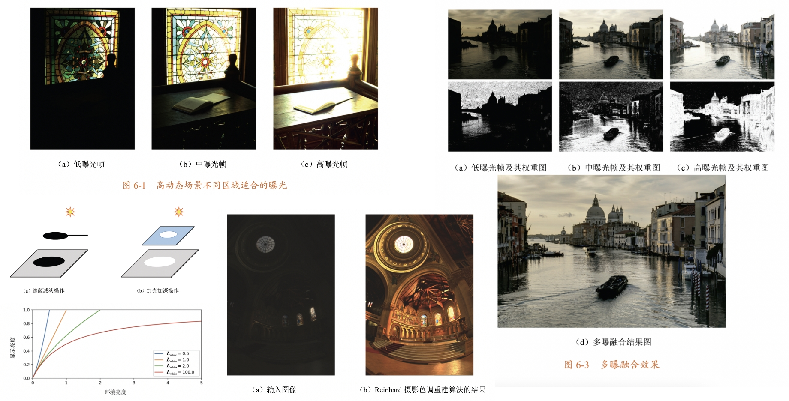
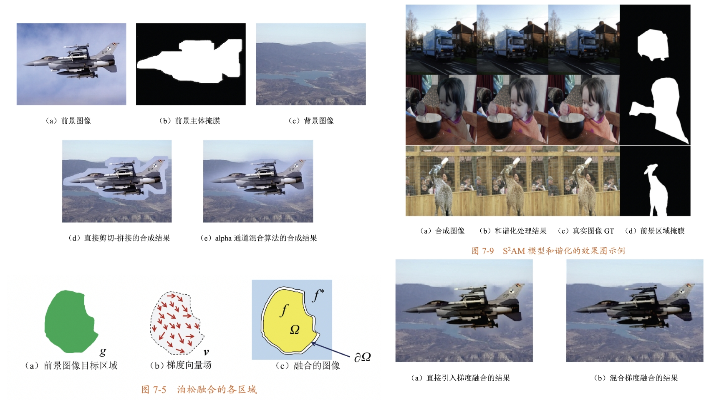

# "Image algorithms for low-level vision tasks" Codebase

[English README](./README.md) | [中文说明文档](./README_zh.md)

Source code for book:

*[Image algorithms for low-level vision tasks (Z. Jia 2024, Publishing House of Electronics Industry, Broadview)](https://book.douban.com/subject/36895899/)*


<p align="center">
  

## How to use

  This repo is the implementations of the methods and algorithms introduced in the above mentioned book. If you find any errors or mistakes in the codes, or typos and tech errors in the book, feel free to open an issue to let me know. An [**Erratum**](./assets/erratum.md) will be maintained in this repo. Thanks for buying and reading this work, hope it be helpful for your studying or research!

## The structure of this codebase

- chapter 1 **Introduction**

  no codes in this chapter
  <p align="center">
  


- chapter 2 **Basics**

  including image transforms, histograms, color, and frequency analysis
  <p align="center">
    

- chapter 3 **Denoise**

  including classical denoising methods (Gaussian/wavelet/BM3D etc.) and DL based denoising method (DnCNN/FFDNet etc.)
  <p align="center">
    

- chapter 4 **Super-Resolution**

  including classical enhancing and DL based SR methods and network implementations (upsampling/USM and SRCNN/RCAN/EDSR etc.)
  <p align="center">
    

- chapter 5 **Dehazing**

  including dehazing methods and networks (dark channel prior, DehazeNet etc.)
  <p align="center">
    

- chapter 6 **HDR**

  including classical HDR methods and DL based networks related to HDR tasks
  <p align="center">
    

- chapter 7 **Composition**

  including alpha blending, laplacian blending and poisson blending, and image harmonization networks
  > example image ref: [link](https://github.com/willemmanuel/poisson-image-editing/tree/master/input/2)
  <p align="center">
    

- chapter 8 **Enhancement**

  including low-light enhancement and color enhancement, retouch methods
  <p align="center">
    


## Citation

  If the content of the book helps you in your research, you can cite this book in the following format

```
@book{jia2024image,
  title={Image algorithms for low-level vision tasks},
  author={Zhuang Jia},
  year={2024},
  publisher={Publishing House of Electronics Industry},
  isbn={9787121478765}
}
```

or in Chinese version as follows

```
@book{贾壮2024图像,
  title={图像画质算法与底层视觉技术},
  author={贾壮},
  year={2024},
  publisher={电子工业出版社},
  isbn={9787121478765}
}
```

## Book references

  Due to the publisher regulations, references of the book are no longer printed in the book. Click [here](./assets/reference.pdf) to see all references corresponding to the subscripts in each chapter.


## Update Logs

1. [2024-03-30] initial upload.
2. [2024-06-06] book information added.
3. [2024-06-18] reference and citation format added, chapter posts changed, add chinese readme

