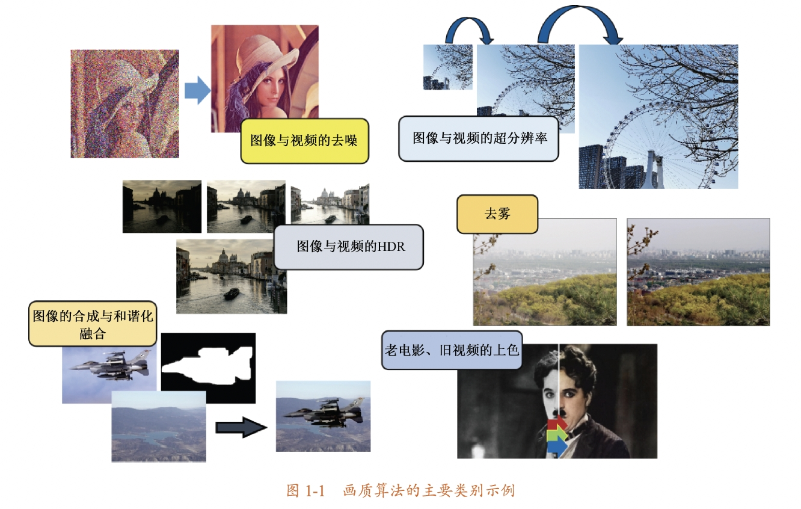
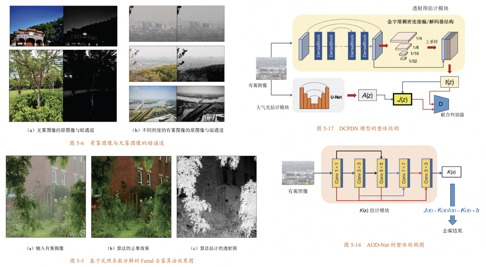
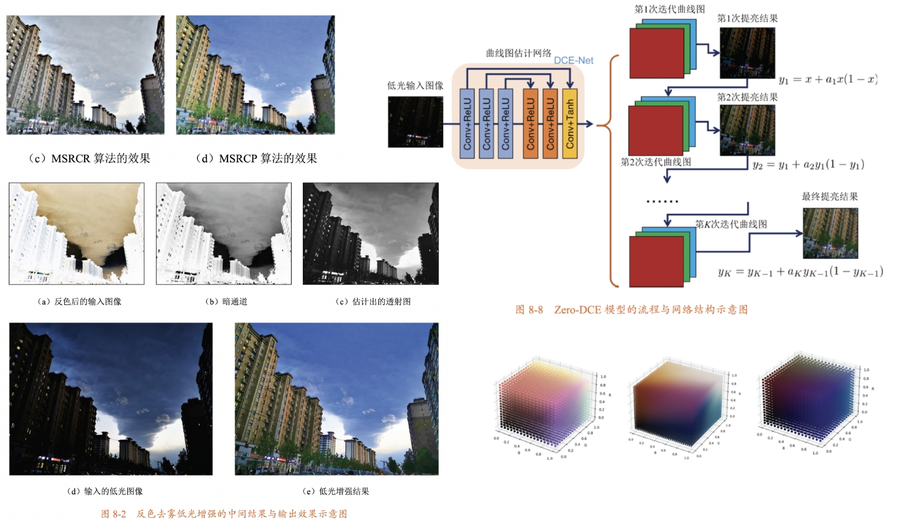

# 《图像画质算法与底层视觉技术》配套代码

[English README](./README.md) | [中文说明文档](./README_zh.md)

本仓库为技术图书: *[图像画质算法与底层视觉技术 (贾壮, 2024, 电子工业出版社, 博文视点)](https://book.douban.com/subject/36895899/)* 的代码库。书中各个章节的代码均可在这里找到。所有代码均已运行验证通过。

<p align="center">
  
  

## 如何使用本书和本仓库

  这个仓库维护上述书中所讲的各种算法和模型结构的代码。如果你在阅读过程中发现技术错误和typo，或者发现代码的错误和问题，请直接在本仓库提issue即可。后续我们将维护一个[勘误表](./assets/erratum.md)用于记录读者找出的问题项。感谢购买并阅读本书，希望可以对你的学习或者研究有所帮助！祝阅读愉快🌺

## 本仓库的内容结构

- chapter 1 **导论**

  本章节无代码
  <p align="center">
  


- chapter 2 **基础知识**

  包括各种图像变换，直方图，颜色，频域分析等内容
  <p align="center">
    

- chapter 3 **去噪**

  包括经典去噪算法（高斯滤波、小波去噪、BM3D等），以及基于深度学习的经典去噪网络结构（比如DnCNN/FFDNet等）
  <p align="center">
    

- chapter 4 **超分辨率**

  包括经典的图像增强算法（锐化、插值），以及基于深度学习的超分辨率模型的实现（SRCNN/RCAN/EDSR等）.
  <p align="center">
    

- chapter 5 **去雾**

  包括经典去雾算法（比如暗通道先验等）以及基于网络的去雾方案介绍
  <p align="center">
    

- chapter 6 **高动态范围**

  包括经典的HDR相关算法，以及基于深度学习的HDR相关领域任务模型
  <p align="center">
    

- chapter 7 **合成与和谐化**

  包括alpha混合、拉普拉斯融合、泊松融合等经典图像合成方法，以及基于网络的合成图像和谐化方案
  > example image ref: [link](https://github.com/willemmanuel/poisson-image-editing/tree/master/input/2)
  <p align="center">
    

- chapter 8 **图像增强**

  包括暗光增强、色彩增强与深度学习修图等算法
  <p align="center">
    


## 引用

  如果你需要在正式的研究或报告中引用本书，请参考以下bibtex格式：

```
@book{贾壮2024图像,
  title={图像画质算法与底层视觉技术},
  author={贾壮},
  year={2024},
  publisher={电子工业出版社},
  isbn={9787121478765}
}
```

或者英文版的引用格式

```
@book{jia2024image,
  title={Image algorithms for low-level vision tasks},
  author={Zhuang Jia},
  year={2024},
  publisher={Publishing House of Electronics Industry},
  isbn={9787121478765}
}
```


## 参考文献

  由于出版社规定不再将参考文献附在每章节末尾，因此在本仓库提供一份参考文献列表，可以点击[这里](./assets/reference.pdf)查看本书所引用的各个章节的所有参考文献，以便后续深入学习。


## 更新日志

1. [2024-03-30] 初始化
2. [2024-06-06] 增加书籍信息
3. [2024-06-18] 增加引用格式与参考文献，更换章节的展示图，增加中文说明文档（就是本文档O(∩_∩)O）

